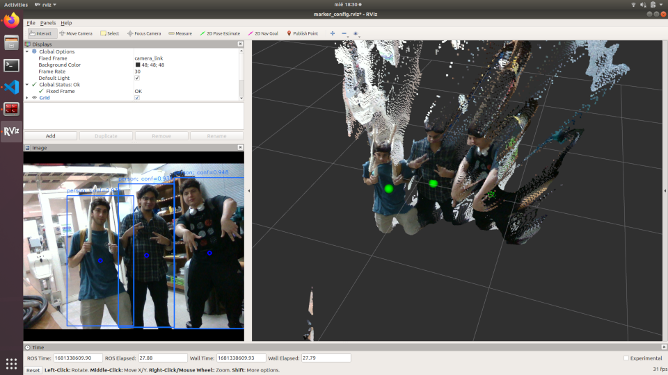

# uchile_vision

Vision features for robots at Universidad de Chile Homebreakers Robotics Team Laboratory. Many thanks to [JP][Jpcaceres] for making this repository possible with his implementation of YoloV5 for ROS melodic.

This package has a class dedicated to making detections with Yolo v5 (other utilities are work in progress). It also includes a custom type of message made for easier communication with other ROS nodes and topics. For more info on how the message type works refer to the [darknet official repository][darknet].

It also includes a depth module for associating detections on the image made with the Yolov5 on the RGB image to the (x,y,z) location of the centroid of the detection associated to the PointCloud generated by the Intel Realsense Library.

## Setup uchile_vision repository

`uchile_vision` repository needs to be in `soft_ws` workspace of Uchile Robotics Workspace.

In `soft_ws` directory open a terminal:

```
cd src/
git clone https://github.com/uchile-robotics/uchile_vision
```

Once installed, we need to run the next set of bash commands:

```
cd yolov5/
sudo python setup.py install
cd src/yolov5/
python2.7 -m pip --no-cache-dir install -r requirements.txt
python2.7 -m pip install future
```
> Note: It's important to run the pip commands exactly how they are exposed, because there is a known bug where installing `pytorch 1.4` without `--no-cache-dir` crashes the computer.

With this done, Yolo v5 should work with ROS Melodic and Python 2.7 (Don't forget to compile every workspace!)

# Usage

## How do I use Yolo v5 in my robot?

In `/uchile_vision/yolov5/src/yolov5/detect.py`, the class `Yolov5()` is defined. For using it in a script it has to be imported from the detect module.

In the same file we can choose between setting `self.device` to either `"cpu"` or `"cuda"`. As you may know, this variable sets the GPU with cuda or CPU for the neural network detections. 
When creating the `Yolov5()` object, we can set the `weights` variable to the weights file location in case of custom weights file. By default, the neural network uses `ycb_v8.pt` weights that where trained in Gazebo using YCB dataset. In this same package exist another weight file called `yolov5_jp.pt`. This weights are the default weights of Yolo v5 neural network, which where trained with COCO dataset.

## Depth Module



The depth_module ROS package implements a class that gets the detections from the same Yolo class referenced in the previous section, and also subscribes to the PointCloud2 message generated by the Intel RealSense Ros Wrapper.
This module requires that said depthcloud is generated in an ordered manner, meaning the indexing matches the one of the RGB image, so that the association between pixel and point is correct. It publishes the detection centroids in their x,y,z coordinates as a MarkerArray ROS message.

The class where the node is implemented is located in  `marker_generator.py `. Also included is a launch file `marker.launch`, which launches the camera wrapper with the required launch parameters, the marker generation node and Rviz with a custom configuration.

## Solving common issues
When using `yolov5_jp.pt` we can get an error where a so called SiLU function does not exist. For solving it open a terminal and execute the following commands:

```
cd 
cd .local/lib/python2.7/site_packages/torch/nn/modules
```

Here edit `activation.py` file and add the following lines at the end of the file:

```
class SiLU(Module):  # export-friendly version of nn.SiLU()
    @staticmethod
    def forward(x):
        return x * torch.sigmoid(x)
```

[//]: # (These are reference links used in the body of this note and get stripped out when the markdown processor does its job. There is no need to format nicely because it shouldn't be seen. Thanks SO - http://stackoverflow.com/questions/4823468/store-comments-in-markdown-syntax)

   [dill]: <https://github.com/joemccann/dillinger>
   [darknet]: <https://github.com/leggedrobotics/darknet_ros/tree/master/darknet_ros_msgs>
   [Jpcaceres]: <https://github.com/Jpcaceres>     
